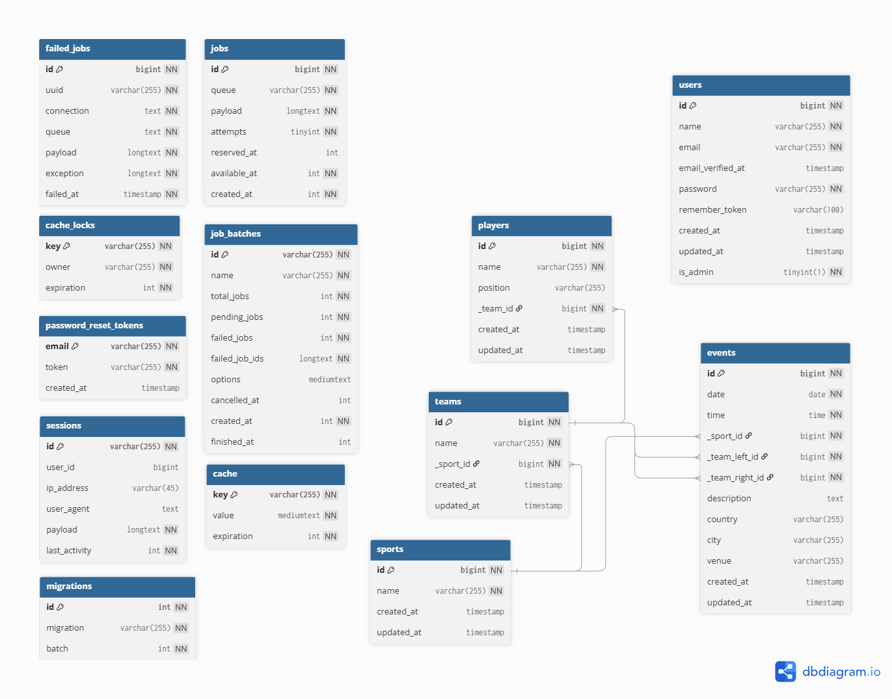

# Sports Calendar

A web application developed for participation in the **Sportradar Coding Academy 2026 (Backend)**.  
The project is a sports event portal where users can explore upcoming and past sports events, filter them by various parameters, and view related information. It also includes an admin panel that allows administrators to manage event data directly through the interface.

## Tech stack
- PHP 8
- Laravel 12
- Laravel Breeze
- MySQL
- Blade Templates
- TailwindCSS
- Node.js 24 + Vite
- PHPUnit
- Composer / NPM

## How to set up locally

Clone my repository to your folder: 
```bash
git clone https://github.com/Mikhail-Banchenko/sports-calendar
cd sports-calendar
```
Install dependencies:
```bash
composer install
npm install
```
Create .env file:
```bash
cp .env.example .env
```
Edit .env and .env.testing (for tests):
```env
DB_CONNECTION=mysql
DB_HOST=127.0.0.1
DB_PORT=3306
DB_DATABASE=sports_calendar
DB_USERNAME=root
DB_PASSWORD=
```
Generate an app key:
```bash
php artisan key:generate
```
Copy the `APP_KEY` from `.env` to [`.env.testing`](.env.testing).

Use migrations and seeders:
```bash
php artisan migrate --seed
```
You can find migrations in the [`database/migrations`](database/migrations) directory and seeders in the [`database/seeders`](database/seeders) directory. Seeder creates an admin user with **login** `admin@example.com` and **password** `admin123`, you can use this account to access the admin panel. This can be changed here: [`/database/seeders/UsersSeeder.php`](/database/seeders/UsersSeeder.php)

### How to run app after set up
Run Backend:
```bash
php artisan serve
```
Run Frontend:
```bash
npm run dev
```

After running this commands, the application will be available at the URL shown in the console output.
Usually: http://127.0.0.1:8000

### How to test app
Some tests are included, such as checking if pages render correctly and verifying permissions for the admin panel (adding, editing, deleting events).  
Run tests using:
```bash
php artisan test --env=testing
```
You can find the tests in the [`tests/Feature/`](tests/Feature/) directory.

## Available routes

My routes:

| Route | Description | Requires admin rights |
|--------|-------------|-----------------------|
| `/`                       | Main page with links and general info                                                | false |
| `/events`                 | Page where users can browse events and apply filters                                 | false |
| `/events/{id}`            | Page showing detailed information about a specific event                             | false |
| ⠀ | ⠀ | ⠀ |
| `/admin`                  | Main page of the admin panel with navigation links                                   | true |
| `/admin/events`           | Admin page listing all events from the database with options to add, edit, or delete | true |
| `/admin/events/create`    | Page where the admin can create a new event                                          | true |
| `/admin/events/{id}/edit` | Page where the admin can edit an existing event                                      | true |

To see the logic behind these routes, check [`routes/web.php`](routes/web.php). 

There are some pre-made routes from Laravel Breeze like `/login` and `/profile`. Look [`/routes/auth.php`](/routes/auth.php) for more info.

## Database structure

The database schema consists of both Laravel system tables and my project tables created specifically for the Sports Calendar application.

### Main entities

| Table | Purpose | Relations |
|--------|----------|------------|
| `sports` | Stores available types of sports (e.g., football, basketball, etc.) | Has many `teams` and `events` |
| `teams` | Stores team information (name, sport, etc.) | Belongs to `sport`, has many `players` |
| `players` | Stores players belonging to teams | Belongs to one `team` |
| `events` | Stores sports events with date, time, place, and related teams | Belongs to one `sport`, has two foreign keys to `teams` |
| `users` | Stores registered users and admins | - |

Additional system tables generated by Laravel include:
`migrations`, `jobs`, `failed_jobs`, `cache`, `sessions`, `password_reset_tokens`, and others used for background processing and authentication.

Here you can see complete Diagram of the project:


Look at [this ERD](erd_of_only_my_tables.png) if you want to see only the models and relationships that I created for this project.

## Assumptions and Decisions

### Technology stack decisions
The project is built using Laravel (PHP framework) with Blade templates and Laravel Breeze for authentication.  
I chose Laravel because of its clean syntax, tools that simplify backend development, and because I already had experience with it.  

Laravel Breeze was used to avoid implementing authentication from scratch and to ensure a secure login and registration system.  
Blade templates allowed me to combine layout and styling logic in one place, which simplified frontend development without introducing additional frameworks.  
The project uses MySQL as its main database engine, because i already worked with it.

### Development decisions

1. **Admin panel and authorization**  
   During the early planning stage, I came up with 2 options how to implement adding events:  
   - creating a hidden route accessible only by URL, or  
   - implementing a full admin panel with authentication and user roles.  
   I decided to build a complete admin panel and extend the `users` table with an `is_admin` field to separate admins from regular users. This looks more like a real project and shows my understanding of authentication and role management.

2. **Database normalization and Eloquent relationships**  
   The database was designed following the **Third Normal Form (3NF)** to avoid redundancy and maintain data consistency.  
   Eloquent ORM relationships were used throughout the models:
   - `Sport` - `hasMany(Team::class)` and `hasMany(Event::class)`  
   - `Team` - `belongsTo(Sport::class)` and `hasMany(Player::class)`  
   - `Player` - `belongsTo(Team::class)`  
   - `Event` - `belongsTo(Sport::class)`, `belongsTo(Team::class, 'team_left_id')` and `belongsTo(Team::class, 'team_right_id')`

3. **Admin interface usability**  
   In the admin panel, I implemented an additional navigation structure that allows administrators to manage events (add, edit, delete) directly through the UI without touching the database manually. Although this added some development work, it improved overall user experience and made the project more complete.

4. **Database query optimization**  
   I avoided running database queries inside loops. Instead, I used Laravel’s Eloquent relationships to construct optimized queries and apply filters efficiently when displaying events.

5. **Design decision**  
   The project was originally developed for a dark theme interface. Later, support for light mode was added. The theme automatically adapts based on the user's browser or system appearance settings — to switch themes, simply change your browser’s theme.

Look at the commit history to see each step I took. If you want to look at AI's usage check [AI_Reflection.txt](AI_Reflection.txt).

## Ideas for Future Development (if I had more time)

Several features could be added in the future to improve both user experience and data presentation:

- **Implement `_result_id` column to `events` table with `results` table**, allowing old events to have recorded match results and enabling statistical analysis based on them (for example winrate of team). 
- **Add team images** can be implemented by adding column (for example `logo_path`) in the `teams` table to store teams logos.   
- **Enhance the main user page** — instead of simple links, display summary information such as:
  - Upcoming events  
  - Recently finished events with results  
  - Filters or quick access to popular sports
- **Improve the admin dashboard** to show quick statistics, such as:
  - Total number of sports, teams, players, and events  
  - Win/loss percentages per team or sport  
  - Quick actions (e.g., “Add new event”, “Manage users”)
- **Implement pagination or lazy loading** for event listings when the database grows.  
- **Add API endpoints** to make event and team data accessible to other services or frontends.  
- **Localization support** — allowing the interface to be easily translated into multiple languages. 
