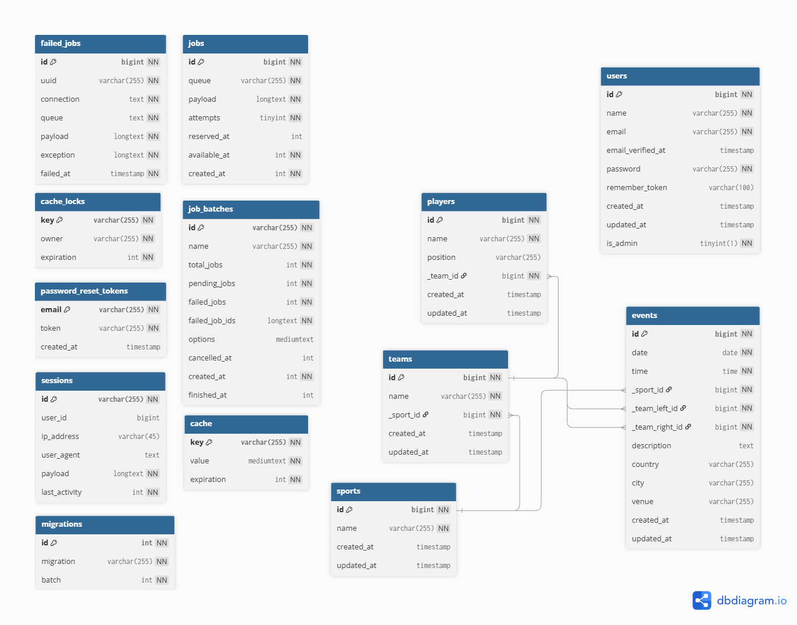

# Sports Calendar

A web application built as a portfolio project to demonstrate backend development skills using Laravel.  
The application represents a sports event portal where users can browse upcoming and past sports events, filter them by various criteria, and view detailed information about each event.

The project also includes an admin panel with authentication and role-based access, allowing administrators to manage sports events directly through the user interface (create, edit, and delete records). The focus of the project is on clean architecture, database design, and practical backend features commonly found in real-world applications.

In addition to the application itself, this repository is intended to showcase my ability to document code and write clear technical documentation.  
Along with the detailed project description in this README, the codebase contains concise, meaningful comments that explain key implementation decisions and improve overall readability and maintainability.


## Tech stack
- PHP 8
- Laravel 12
- Laravel Breeze
- MySQL
- Blade Templates
- TailwindCSS
- Node.js 24 + Vite
- PHPUnit
- Composer / NPM

## How to set up locally

Clone my repository to your folder: 
```bash
git clone https://github.com/Mikhail-Banchenko/sports-calendar
cd sports-calendar
```
Install dependencies:
```bash
composer install
npm install
```
Create .env file:
```bash
cp .env.example .env
```
Edit .env and .env.testing (for tests):
```env
DB_CONNECTION=mysql
DB_HOST=127.0.0.1
DB_PORT=3306
DB_DATABASE=sports_calendar
DB_USERNAME=root
DB_PASSWORD=
```
Generate an app key:
```bash
php artisan key:generate
```
Copy the `APP_KEY` from `.env` to [`.env.testing`](.env.testing).

Use migrations and seeders:
```bash
php artisan migrate --seed
```
You can find migrations in the [`database/migrations`](database/migrations) directory and seeders in the [`database/seeders`](database/seeders) directory. Seeder creates an admin user with **login** `admin@example.com` and **password** `admin123`, you can use this account to access the admin panel. This can be changed here: [`/database/seeders/UsersSeeder.php`](/database/seeders/UsersSeeder.php)

### How to run app after set up
Run Backend:
```bash
php artisan serve
```
Run Frontend:
```bash
npm run dev
```

After running this commands, the application will be available at the URL shown in the console output.
Usually: http://127.0.0.1:8000

### How to test app
Some tests are included, such as checking if pages render correctly and verifying permissions for the admin panel (adding, editing, deleting events).  
Run tests using:
```bash
php artisan test --env=testing
```
You can find the tests in the [`tests/Feature/`](tests/Feature/) directory.

## Available routes

My routes:

| Route | Description | Requires admin rights |
|--------|-------------|-----------------------|
| `/`                       | Main page with links and general info                                                | false |
| `/events`                 | Page where users can browse events and apply filters                                 | false |
| `/events/{id}`            | Page showing detailed information about a specific event                             | false |
| ⠀ | ⠀ | ⠀ |
| `/admin`                  | Main page of the admin panel with navigation links                                   | true |
| `/admin/events`           | Admin page listing all events from the database with options to add, edit, or delete | true |
| `/admin/events/create`    | Page where the admin can create a new event                                          | true |
| `/admin/events/{id}/edit` | Page where the admin can edit an existing event                                      | true |

To see the logic behind these routes, check [`routes/web.php`](routes/web.php). 

There are some pre-made routes from Laravel Breeze like `/login` and `/profile`. Look [`/routes/auth.php`](/routes/auth.php) for more info.

## Database structure

The database schema consists of both Laravel system tables and my project tables created specifically for the Sports Calendar application.

### Main entities

| Table | Purpose | Relations |
|--------|----------|------------|
| `sports` | Stores available types of sports (e.g., football, basketball, etc.) | Has many `teams` and `events` |
| `teams` | Stores team information (name, sport, etc.) | Belongs to `sport`, has many `players` |
| `players` | Stores players belonging to teams | Belongs to one `team` |
| `events` | Stores sports events with date, time, place, and related teams | Belongs to one `sport`, has two foreign keys to `teams` |
| `users` | Stores registered users and admins | - |

Additional system tables generated by Laravel include:
`migrations`, `jobs`, `failed_jobs`, `cache`, `sessions`, `password_reset_tokens`, and others used for background processing and authentication.

Here you can see complete Diagram of the project:


Look at [this ERD](erd_of_only_my_tables.png) if you want to see only the models and relationships that I created for this project.

## Assumptions and Decisions

### Technology stack decisions

- The project is built using **Laravel** as the main backend framework due to its strong ecosystem and suitability for building structured, maintainable web applications. Laravel provides a clear MVC architecture, expressive routing, built-in validation, and an ORM (Eloquent) that simplifies working with relational databases while keeping business logic readable and well-organized.

- **Blade templates** were chosen for server-side rendering to keep the frontend tightly integrated with the backend logic. This approach allows fast development, predictable data flow, and avoids unnecessary complexity that would come with introducing a separate frontend framework for a project of this scope.

- **Laravel Breeze** is used to handle authentication and basic user management. 

- **TailwindCSS** is used for styling due to its utility-first approach, which enables consistent UI development without writing large amounts of custom CSS. It also integrates well with Blade templates and allows rapid iteration on layouts and themes.

- For testing, **PHPUnit** is used to validate core application behavior, including page rendering and access control. This ensures that key functionality works as expected and that admin-only features are properly protected.

- Dependency management is handled using **Composer** for PHP packages and **NPM** for frontend tooling, following standard practices in the Laravel ecosystem.

### Development decisions

1. **Admin panel and authorization**  
   During the early planning stage, I came up with 2 options how to implement adding events:  
   - creating a hidden route accessible only by URL, or  
   - implementing a full admin panel with authentication and user roles.  
   I decided to build a complete admin panel and extend the `users` table with an `is_admin` field to separate admins from regular users. This looks more like a real project and shows my understanding of authentication and role management.

2. **Database normalization and Eloquent relationships**  
   The database was designed following the **Third Normal Form (3NF)** to avoid redundancy and maintain data consistency.  
   Eloquent ORM relationships were used throughout the models:
   - `Sport` - `hasMany(Team::class)` and `hasMany(Event::class)`  
   - `Team` - `belongsTo(Sport::class)` and `hasMany(Player::class)`  
   - `Player` - `belongsTo(Team::class)`  
   - `Event` - `belongsTo(Sport::class)`, `belongsTo(Team::class, 'team_left_id')` and `belongsTo(Team::class, 'team_right_id')`

3. **Admin interface usability**  
   In the admin panel, I implemented an additional navigation structure that allows administrators to manage events (add, edit, delete) directly through the UI without touching the database manually. Although this added some development work, it improved overall user experience and made the project more complete.

4. **Database query optimization**  
   I avoided running database queries inside loops. Instead, I used Laravel’s Eloquent relationships to construct optimized queries and apply filters efficiently when displaying events.

5. **Design decision**  
   The project was originally developed for a dark theme interface. Later, support for light mode was added. The theme automatically adapts based on the user's browser or system appearance settings — to switch themes, simply change your browser’s theme.

## Potential Improvements and Future Enhancements

The following ideas outline possible directions for extending the project further.

- **Event results and statistics system**  
  Introduce a dedicated `results` table linked to events, allowing completed events to store match outcomes.  
  This would enable statistical features such as team win/loss ratios, historical performance analysis, and sport-level summaries.

- **Media support for teams and events**  
  Add support for team logos and event-related images by storing file paths (e.g. `logo_path`) and implementing a media upload pipeline.  
  This would require handling file storage, validation, and access control.

- **Admin dashboard analytics**  
  Extend the admin panel with a dashboard that provides operational insights, including:
  - total counts of sports, teams, players, and events,
  - basic statistics per sport or team,
  - shortcuts for common administrative actions.  
  This would demonstrate data aggregation and backend-driven analytics.

- **Pagination and performance optimization**  
  Introduce pagination, lazy loading, or caching strategies for event listings to ensure consistent performance as the dataset grows.

- **Public API layer**  
  Expose selected data through RESTful API endpoints, making the system usable by external clients or alternative frontends.  
  This would include API authentication, request validation, and versioning.

- **Localization and internationalization**  
  Add multi-language support using Laravel’s localization features, making the application adaptable for different regions and audiences.

- **Role-based access expansion**  
  Extend the current authorization system to support multiple user roles (e.g. editors, moderators) with fine-grained permissions, improving security and scalability.

